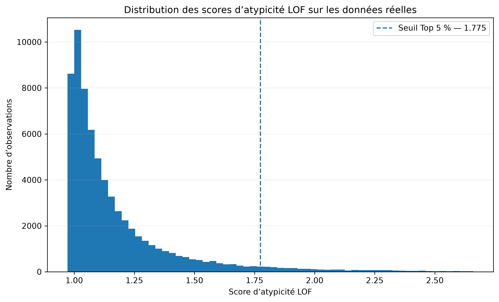
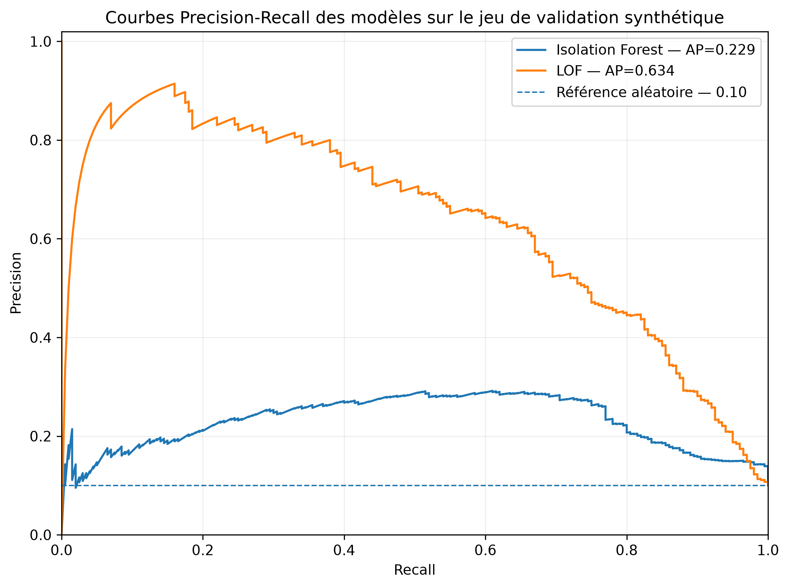
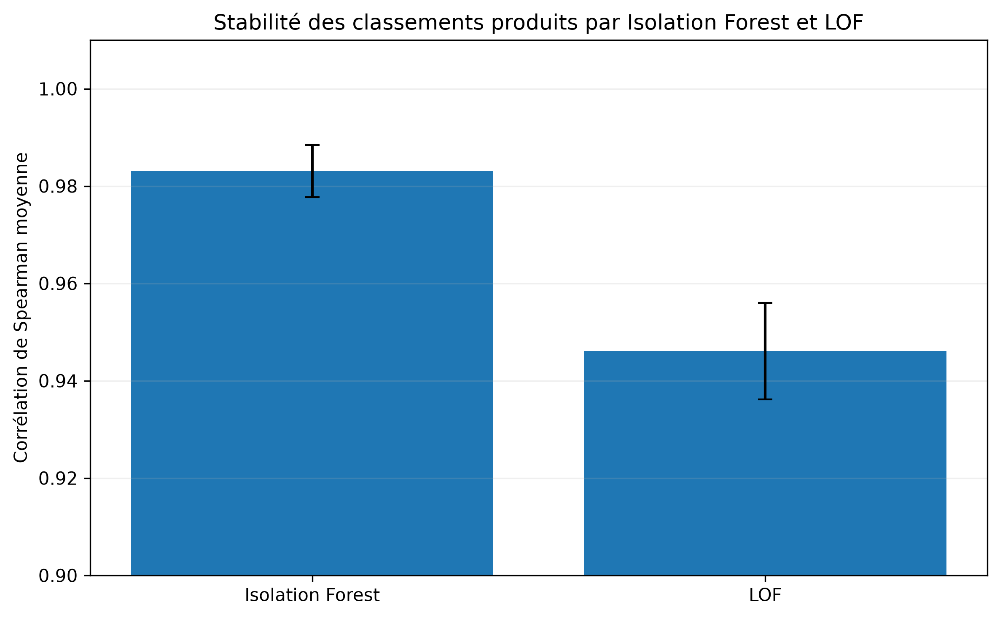
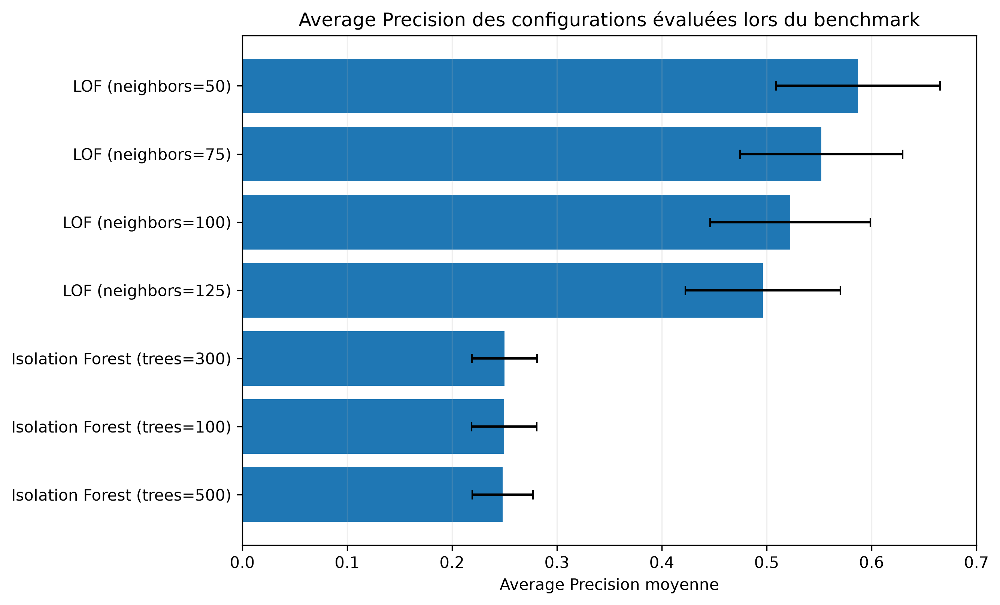
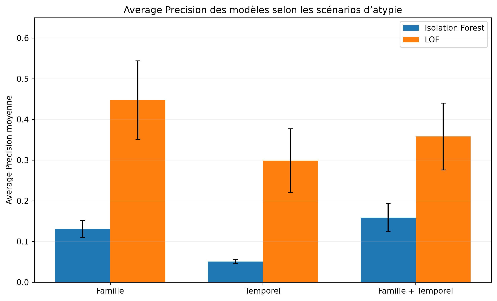

# Notebook 05 — Anomaly Detection

## Objectif

Ce notebook constitue le cœur analytique du projet. Il cherche à identifier des comportements économiquement atypiques à la granularité **EAN × mois**, puis à les contextualiser et les prioriser.

## Fonctionnement

La détection combine plusieurs niveaux de signal :

### 1. Règles métier

Des incohérences économiques explicites sont recherchées, notamment sur les prix et les taux de marge.

### 2. Contexte familial

Chaque observation est comparée aux produits comparables de son environnement métier à période comparable. Des mesures robustes permettent d’identifier un écart inhabituel par rapport au comportement de la famille.

### 3. Contexte temporel

Chaque observation est comparée à l’historique disponible du même EAN afin d’identifier une rupture de comportement.

### 4. Machine Learning

Deux méthodes non supervisées sont comparées :

- Isolation Forest ;
- Local Outlier Factor (LOF).

Le Machine Learning produit un score continu d’atypicité.

## Validation

Les données réelles ne disposent pas de labels exhaustifs. Une validation synthétique est donc réalisée sur **2 000 observations**, dont **200 observations perturbées**. Plusieurs scénarios, niveaux de perturbation, paramètres et seeds sont évalués.

L’**Average Precision** est la métrique principale, complétée par la ROC-AUC et l’analyse de stabilité des classements.

## Résultats du benchmark

Les meilleures performances globales obtenues sont :

| Configuration | AP | ROC-AUC |
|---|---:|---:|
| LOF — 50 voisins | 0,622 | 0,904 |
| LOF — 75 voisins | 0,597 | 0,894 |
| LOF — 100 voisins | 0,573 | 0,887 |
| LOF — 125 voisins | 0,548 | 0,881 |
| Isolation Forest — 500 arbres | 0,247 | 0,814 |
| Isolation Forest — 300 arbres | 0,247 | 0,813 |
| Isolation Forest — 100 arbres | 0,240 | 0,804 |

La configuration retenue pour l’application aux données réelles est **LOF avec 50 voisins**.

## Application aux données réelles

Sur **68 324 observations**, le pipeline produit :

- **1 663** signaux issus des règles métier ;
- **3 417** observations dans le Top 5 % du classement ML ;
- **222** doubles signaux règle métier + ML ;
- **4 858** observations dans le périmètre d’attention.

La priorisation finale distingue les observations **Critiques**, **À surveiller** et **Normales**. Le Top 5 % est un seuil opérationnel de priorisation, et non un seuil statistique universel d’anomalie.

## Visualisations principales

Les figures principales peuvent être consultées dans le dossier `figures/` :

Les figures illustrent notamment :

- la distribution des scores LOF sur les données réelles ;
- les courbes Precision-Recall ;
- la stabilité des classements ;
- les performances AP du benchmark ;
- les performances selon les scénarios.

## Interprétation

Le score ML indique une atypicité dans la représentation comportementale. Il ne prouve pas à lui seul une erreur ou un impact financier. Les signaux métier, familiaux et temporels sont conservés pour faciliter l’analyse et l’investigation.
